# :wave: Hi there, I'm KitKatt!

A person that mostly focuses on game and software development and does art. (Vibe-"Coding" is not coding, change my mind.)
#### 
- Pronouns: [she/they/any](https://en.pronouns.page/@_simplykatt)

## 📌 Key Notes

- Self-Taught HTML/CSS, Javascript/Node.js, Lua, and C++ developer.
- Certified in Web Development, among other things.
- Started coding around late **2019**.
- Grateful Founder/Director of [`Nirmini Development`](https://github.com/Nirmini).

## 🛠️ Projects
### These are projects of mine or that I'm involved in.
#### ⚙️ General Projects
- 🤖 [`Nova`](https://github.com/Nirmini/Nova) - A multi-purpose Discord bot and moderation platform for communities of all sizes.
   - [`NovaCore`](https://github.com/thatWest7014/NovaCore) - The open-sourced core application layer of Nova that we run the Discord.js instance off of.
   - [`NovaWorks`] - Nova's Roblox integration and deprecated internal API.
   - [`NovaAPI`] - Nova's Public and Internal API that users can build with
#### 🎮 Game Development Projects
- 🏢 [`Nirmini Research Complex`] - A Roblox Science Fiction game developed by Nirmini Development that takes place in 2028.
- 🔪 [`Untitled Roblox Game`] - A Roblox multiplayer survival game developed by Untitled Roblox Game Group.
- 🎥 [`Starlight Media Center `] - A Roblox event venue and recording studio for Starlight Media, which is part of Nirmini.
- 🔫 [`Project Vexel`] - A currently delayed Roblox FPS game with PvP and PvE aspects developed by Nirmini Development.
- 🔧 [`Bot Maker's Toolkit`] - A Windows App built on GameMaker & Node.js that allows users to create and manage Discord bots via Discord.js.

##### 
> *Please note that I tend to get in and out of projects frequently, so this may not be entirely accurate.*

## 📊 Github Stats

---

## Here's some of the things I've worked with over the years:

### Languages

### Tools

### Platforms

  
Links

  - [`Discord`](https://discord.gg/9Y7aZejzUH)  
  - [`NovaBot`](https://github.com/Nirmini/NovaBot)  
  - [`GitHub Readme Stats`](https://github.com/stats-organization/github-readme-stats-action)  
  - [`Skill Icons`](https://skillicons.dev)  

