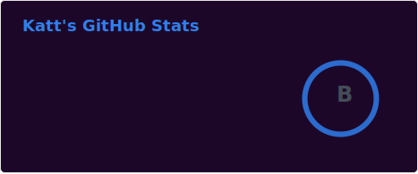
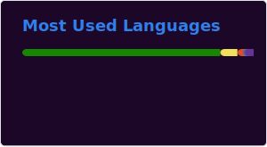

---
# :wave: Hi there, I'm KitKatt!

I'm a student who generally works in Information Technology (IT) alongside Cybersecurity. In other words, I get to assemble the trains and their tracks and then try to derail them. ([Based on the introduction to "Hacking Google"](https://www.youtube.com/watch?v=przDcQe6n5o)) I also do art and a few other hobbies and projects, including film production, pixel art, and many, many more. My opinion on AI can generally be summed up as "it sucks 99% of the time unless it's locally run." I am also the director/founder of the Nirmini Development group, a software and game development group that was originally [founded on the Roblox platform](https://www.roblox.com/communities/33610529/Nirmini). (Vibe-coding isn't coding, btw, just because coding teaches you things and vibe-coding doesn't.)

#### 
- Pronouns: [she/her/they](https://en.pronouns.page/@_simplykatt) :transgender_flag:

## 📌 Key Notes

- Self-Taught HTML/CSS, Javascript/Node.js, Lua C++, and C# developer.
- Certified in Web Development, among other things.
- Started coding around late **2019**.
- Grateful Founder/Director of [`Nirmini Development`](https://github.com/Nirmini).

## 🛠️ Projects & 🖋 Pentests
### These are projects of mine or that I'm involved in.
#### 🤖 Discord Bot Projects
- [`Nova`](https://github.com/Nirmini/Nova) - A multi-purpose Discord bot and moderation platform for communities of all sizes.
   - [`NovaCore`](https://github.com/thatWest7014/NovaCore) - The open-sourced core application layer of Nova that we run the Discord.js instance off of.
   - [`NovaWorks`](https://platform.nirmini.dev/docs/platform/nworks) - Nova's Roblox integration and deprecated internal API.
   - [`NovaAPI`](https://platform.nirmini.dev/docs/api/nova) - Nova's Public and Internal API that users can build with
#### 🎮 Game Development Projects
- [`Nirmini Research Complex`] - A Roblox Science Fiction game developed by Nirmini Development that takes place in 2028.
- [`Untitled Roblox Game`] - A Roblox multiplayer survival game developed by Untitled Roblox Game Group.
- [`Starlight Media Center `] - A Roblox event venue and recording studio for Starlight Media, which is part of Nirmini.
- [`Bot Maker's Toolkit`] - An App built on GameMaker & Node.js that allows users to create and manage Discord bots via Discord.js.

#### 📚 Hobby Projects
- [`LocalMatter`] - A completely self-hosted matter device controller that can be run locally or connected to a Google/Apple home
   - [`AntiMatter`] - The web-based dashboard for the application and home management utility
   - [`AntiGravity`] - The C#-based dashboard for the app and the home utility, alongside some other changes compared to the web dashboard.
- [`LIFX-Testing`] - Testing package I made to better manage lights in a way that works and runs locally, and supports a majority of the features of the smart app, minus the presets.

#### 🛠️ General Projects
- [`Nirmini.dev`](https://nirmini.dev) - Website for my development group, Nirmini, or more formally, Nirmini Development.
- [`Nirmini API`](https://api.nirmini.dev) - Cloudflare Pages-based API created in Typescript and JavaScript that handles user authentication, various application features, etc.
- [`Nirmini Developers Platform`](https://platform.nirmini.dev) - A Cloudflare Page that uses React.js to allow developers to read over documentation, test various APIs, and manage accounts.
- [`BetterYTPlaylists`] - A project to create a better YT Playlist widget within WordPress, created in PHP.

#### 🖊️ Pentests
- [`Securly Classroom`](https://www.securly.com/classroom), Initially reported March 23rd, 2026

##### 
> *Please note that I tend to get in and out of projects and such pretty frequently, so this may not be entirely accurate.*

## 📊 Github Stats

---

## Here are some of the things I've worked with over the years:

### Languages

### Tools

### Platforms

## Contact me
- [`Discord`](https://discord.com/users/600464355917692952)
- [`Email`](mailto:west701497@gmail.com)
- [`Nirmini Support`](mailto:support@nirmini.dev)
- [`Roblox`](https://www.roblox.com/users/798440211)

  
Links

  - [`Discord`](https://discord.gg/9Y7aZejzUH)  
  - [`NovaBot`](https://github.com/Nirmini/NovaBot)  
  - [`GitHub Readme Stats`](https://github.com/stats-organization/github-readme-stats-action)  
  - [`Skill Icons`](https://skillicons.dev)  

